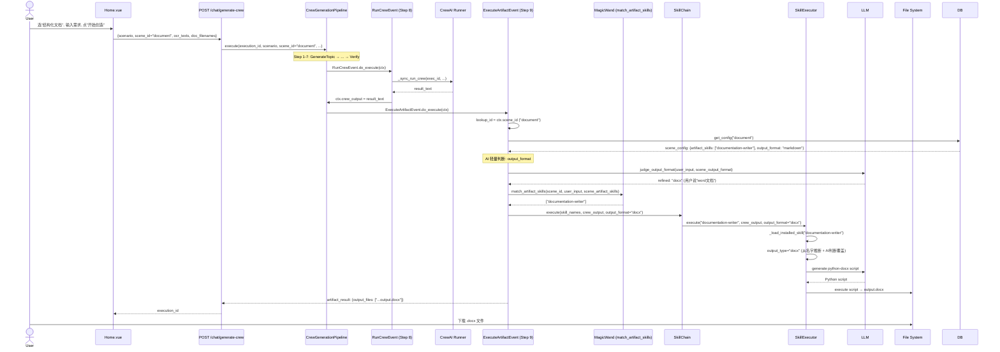

# scene_id 透传修复 + output_format 重构

## 修复的 Bug

任务 `20260602_190510_752c72ec` (结构化文档 → 没生成 .docx) 的根因链:

```
ctx.scenario = "[结构化文档] 我家南通..."  ← 完整用户输入
  ↓
get_config(ctx.scenario) → WHERE id = '[结构化文档]...'  ← 永远不匹配!
  ↓
scene_artifact_skills = None  ← DB 里配置的 ["documentation-writer"] 未读取
  ↓
魔法棒 fallback → 关键词匹配 → 找到 documentation-writer
  ↓
_load_installed_skill → output_type = ""  ← 未从名字推断
  ↓
_build_system_prompt → "请直接输出结果内容" ← 告诉 LLM 输出文本
  ↓
LLM 输出 markdown → 当 Python 脚本执行 → SyntaxError → 失败
```

## 修复 1: scene_id 全链路透传

### 变更文件

| 文件 | 改动 |
|------|------|
| `crewai_web/web/domain/chat.py` | ChatStreamRequest 加 `scene_id: Optional[str]` |
| `crewai_web/core/event/event_context.py` | EventContext 加 `scene_id: Optional[str]` |
| `crewai_web/web/services/crew_generation_pipeline.py` | execute() 加 `scene_id` 参数 → EventContext |
| `crewai_web/web/api/chat.py` | 透传 `request.scene_id` |
| `crewai_web/web/events/execute_artifact_event.py` | 用 `ctx.scene_id` 查 get_config() + title fallback |
| `crewai_web/web/services/scene_config_service.py` | 新增 `get_config_by_title()` |
| `frontend/src/views/Home.vue` | `generateCrew(scenario, sceneId, ...)` |
| `frontend/src/api/index.ts` | `generateCrew(scenario, scene_id?, doc_filenames?, ocr_texts?)` |
| `frontend/src/views/Chat.vue` | 传 `undefined` 给 scene_id |

## 修复 2: output_type 自动推断

| 文件 | 改动 |
|------|------|
| `crewai_web/web/services/skill_executor.py` | `_load_installed_skill()` 用 `_infer_output_type_from_name()` 推断 output_type; 非文件类型跳过脚本执行 |

## 调用链 (修复后)



## 架构图: 数据驱动的输出格式

```mermaid
flowchart LR
    subgraph 数据源
        DB[(scene_configs)]
        DB -->|output_format| OF[output_format<br/>markdown/pptx/docx/...]
        DB -->|artifact_skills| AS[artifact_skills<br/>["pptx","documentation-writer"]]
    end
    
    subgraph AI轻量判断
        UI[用户输入: "...word文档"] --> AI[/AI Judge/]
        OF --> AI
        AI -->|refined| RF[最终 output_format<br/>docx]
    end
    
    subgraph 执行
        RF --> SC2[SkillChain]
        AS --> SC2
        SC2 --> SE2[SkillExecutor]
        SE2 --> File[📄 output.docx]
    end
    
    style DB fill:#e1f5fe
    style AI fill:#fff3e0
    style File fill:#e8f5e9
```
